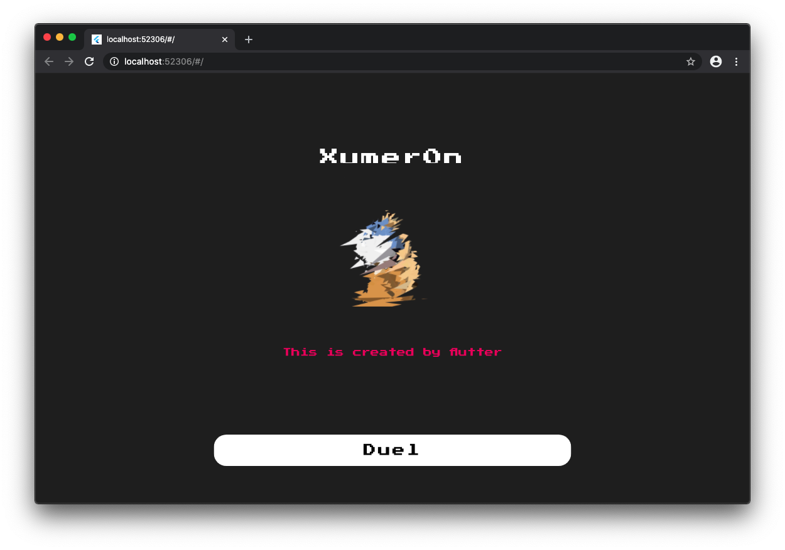
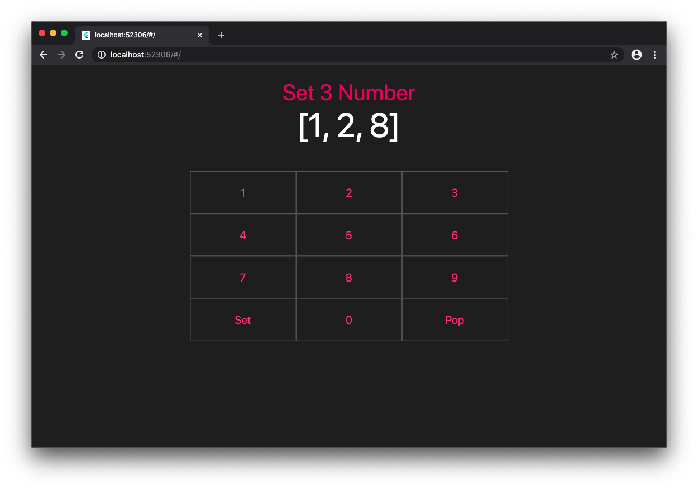
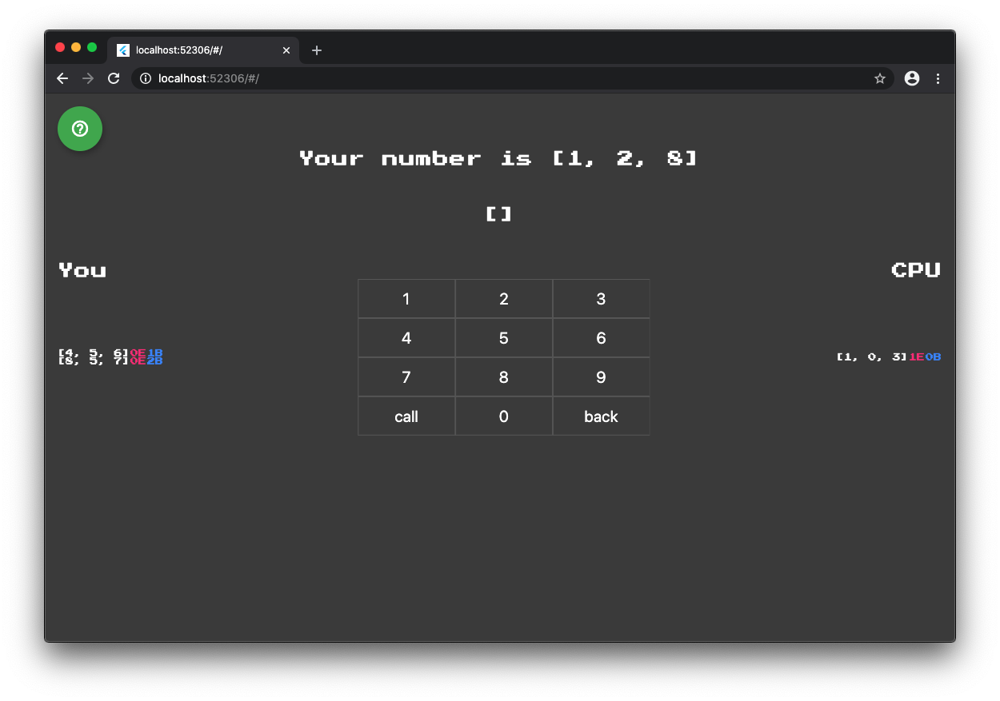

# Xumer0n

- https://xumer0n.netlify.app/#/

This game is called `Numer0n` in my country, Japan.
In contrast, `MOO`, `Hit & Blow`, `Cow & Bull` might be much more common name in all over the world.

# Rule

Goal is to predict 4 numbers that CPU selected.

`BITE` means that only number itself is correct.
`EAT` means that the number and the position is correct.

If a particular number had both `E/B`, `E` would be prefered.

Here are some examples.

    CPU has 0631

- Call 1234, this has `1Eat0Bite`
- Call 4985, this has `0Eat0Bite`
- Call 6102, this has `0Eat2Bite`
- Call 3672, this has `1Eat1Bite`
- Call 0631, this has `4Eat0Bite`  -> Win

I created best strategy for CPU. Could you beat it?

### Algorithm

In a nutshell, this CPU is likely to minimize the size of set that consists of possible candidates.

Before wi'll dive into the explanation, let me define some keywords.

- `Moo Product` is `(Number of EAT, Number of BITE)`

After CPU make a prediction and get the Moo Product which is corresponding to Real Answer, he calculate all Moo Product with each candidate and his Prediciton due to the fact that Good candidates have the same Moo Product, right?

By removing bad predictions from set of candidates, he is able to achieve minimization of the set.